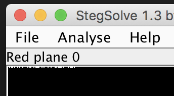

# Galaxy
Forensics

## Challenge 

I found this interesting picture in my astronomy textbook but I don't know whats special about it. Maybe a reverse image search will help.

galaxy

## Solution

Doing reverse image search, we know it is a Low Surface Brightness galaxy.

This hints us at LSB.

In StegSolve, we see some bits at the LSB for Red, Green and Blue...

Created a simple script in ruby 
	
	$ ruby solve.rb 
	tjctf{last_but_n0t_l3ast}

## Flag

	tjctf{last_but_n0t_l3ast}