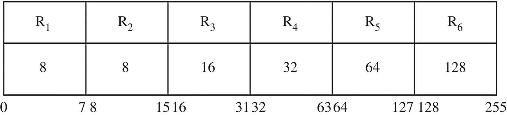
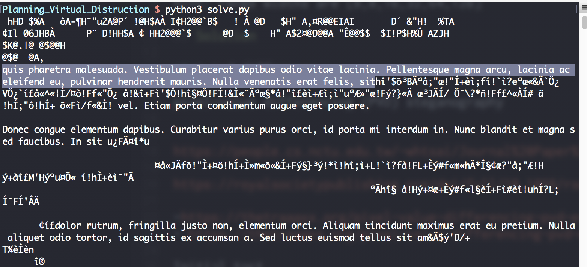
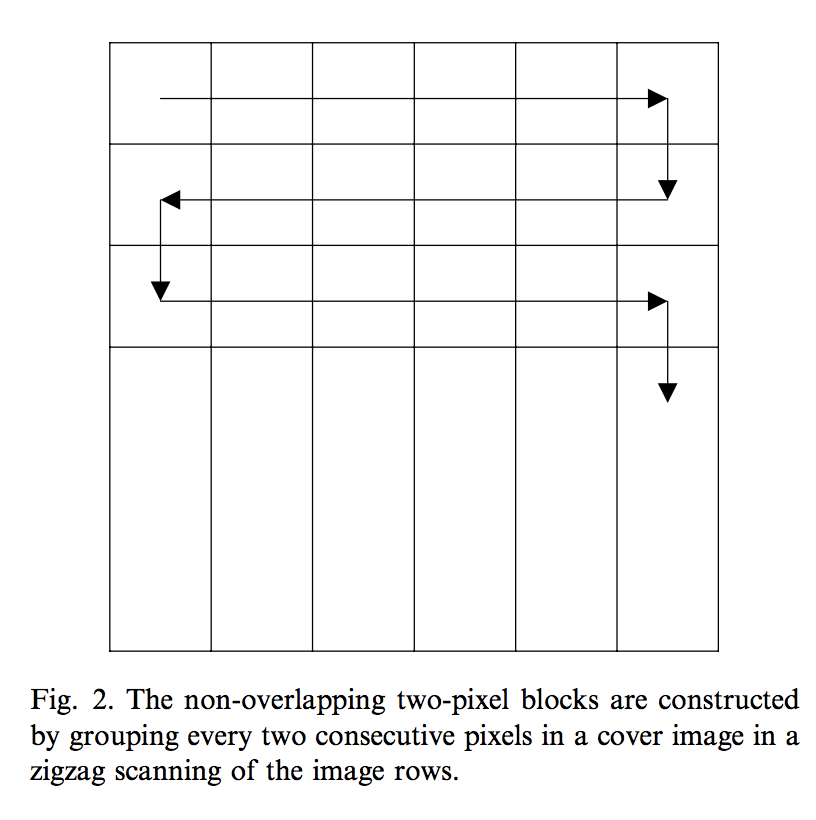
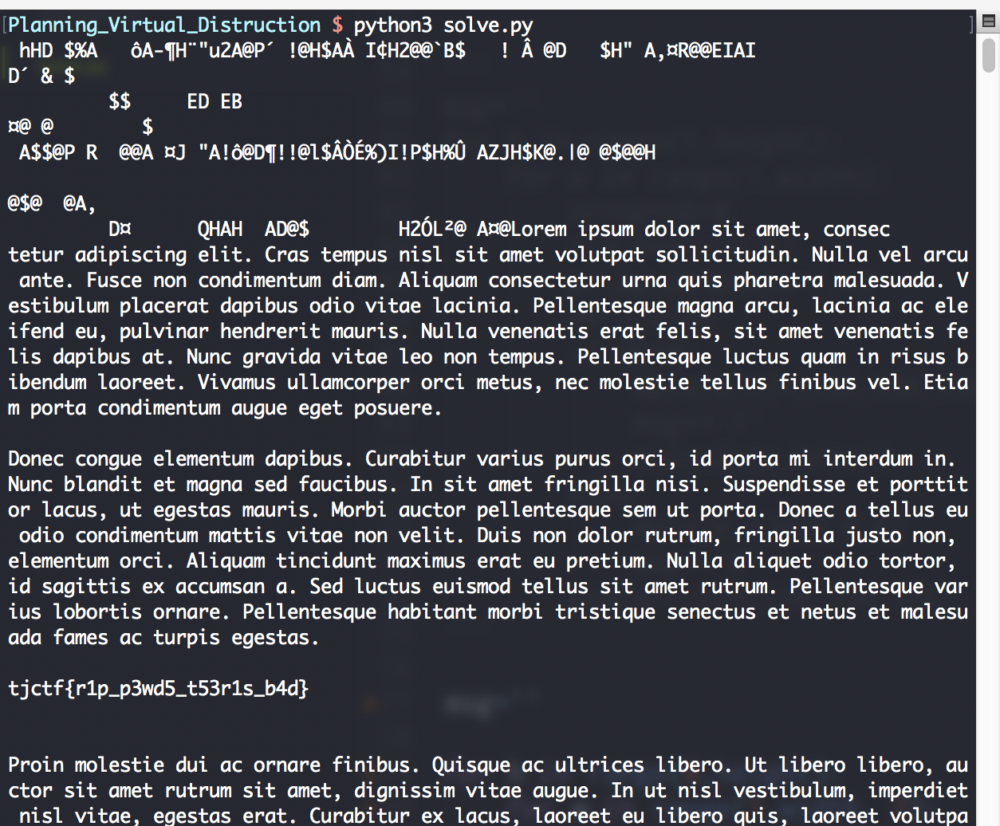

# Planning Virtual Distruction
Forensics

## Challenge 

In his quest for world domination, Omkar realized that he needed to conquer more than just land, so he turned to conquering the internet. His first target was becoming the king of youtube by overcoming Pewdiepie. As a result, he embodied his Indian culture, creating the channel TSeries. In a step to stop Omkar's world domination, we need to regain control of the internet. Perhaps you can uncover his plans hidden in this image and make a DIFFERENCE before it is too late.

Hint: range widths are [8,8,16,32,64,128]

## Solution

#### Pixel-value differencing
Search the acronym of the title (PVD) and we find out about Pixel-value differencing (PVD) steganography

This is the original paper of Pixel value differencing (PVD) by Wu and Tsai

- https://people.cs.nctu.edu.tw/~whtsai/Journal%20Paper%20PDFs/Wu_&_Tsai_PRL_2003.pdf

Additional resources explaining the PVD algorithm

- https://royalsocietypublishing.org/doi/full/10.1098/rsos.161066
- https://thetraaaxx.org/pixel-value-differencing-pvd-explications (in French)

The hint also gives us a range, which is the standard quantization range table as proposed in the academic paper.

#### Implementation

I did an initial test where I implemented a function `calculate_bits()`. It is based on the following description from the papers.

When running it through all cosecutive pairs of pixels, I observed a lorum ipsum statement.

My initial test was scanning from left to right only. However, the paper stated a zig-zag pattern.

I modified my code to scan zig-zag and we get the flag

## Flag

	tjctf{r1p_p3wd5_t53r1s_b4d}
