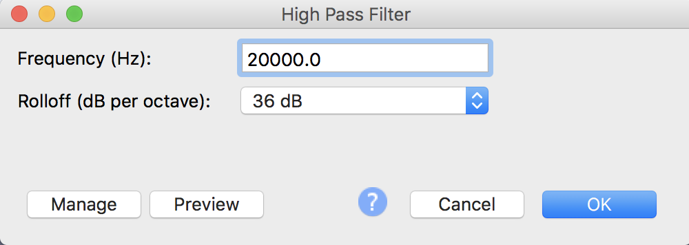
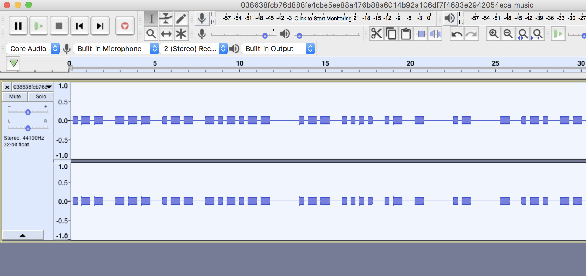

# SOS
Forensics

## Challenge 

Help! I swiped this off some extraterrestrial musician's laptop, but I think I'm getting trolled. I tried to intercept their communications, but their frequency is just too high. There's something wrong, but I just can't put my ear on it...

## Solution

From the challenge, "but their frequency is just too high"...

We know that the highest frequency humans can hear is 20,000 Hz

So let's extract the high frequency sound in Audacity

> In Audacity, `Effect > High Pass Filter > 20000 Hz`

Now, we can see somw waveforms, which seem to be morse code (hinted in the title of SOS)

With this, I simply exported the WAV file and parsed the morse code in a Ruby script.

My filtering logic is not perfect, but we see the flag

	.-- --- .-- -.-.---- .... .- -- .-. --- .-.. .-.. --..--- ----. .. --. .... - ..--.--- . .-.. .-.. --..-- -. --- ..- --. ...--- ..-- .... .- - --..--... . .-. . .----. ..- .... -.-. .-.. .- --. ---..- .--- -.-. - ..-. .--.- -- -.-- ...- --- .. -.-. . .. ... --. .-. --- .-- .. -. --. -- --- .-. ... .
	wow?hamroll?9ight?ell?noug??hat?ere?uhclag?jctf?myvoiceisgrowingmorse

## Flag

	tjctf{myvoiceisgrowingmorse}