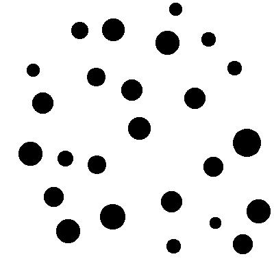
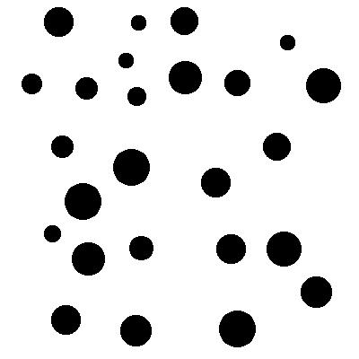
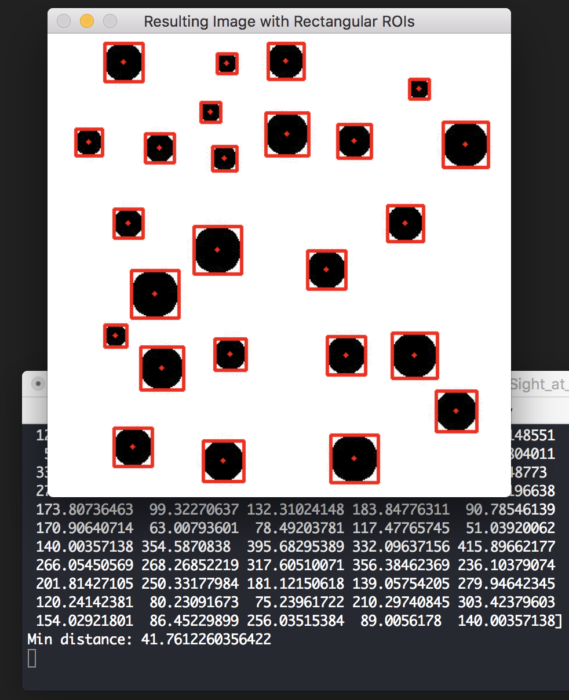

# Sight at Last
Misc

## Challenge 

nc p1.tjctf.org 8005

## Solution

Challenge gives us an image with many circles. We need to get center points of the circles.

	$ nc p1.tjctf.org 8005
	To get the flag, solve a hundred captchas in 500 seconds!
	Find the minimum distance between the centers of two circles to continue:
	<base64 image>

My initial thought was to use some sort of circle detecting algorithm to get the center of the circles. However, it is realised that the algorithm is not very accurate.

- https://www.pyimagesearch.com/2014/07/21/detecting-circles-images-using-opencv-hough-circles/

It is noticed that the images all have high contrast with no overlapping circles

Hence, we can simply use a bounding rectangle to contain the circle. 

The center point of the bounding rectangle is also the center point of the circle. The distances between each combination of the points are calculated and the minimum distance is found.

- http://hanzratech.in/2015/02/24/handwritten-digit-recognition-using-opencv-sklearn-and-python.html
- https://www.geeksforgeeks.org/closest-pair-of-points-onlogn-implementation/

Using Python OpenCV, I made it detect all the circles and also get the center points. 

Now, interface it with the server to get the flag

	$ python3 solver.py 
	Received: To get the flag, solve a hundred captchas in 500 seconds!
	Find the minimum distance between the centers of two circles to continue:
	...
	...
	... 
	Found 25 circles
	Found distance: 46.87216658103186
	Received: Correct! You have 430.0 seconds left.

	Nice! Your flag is:  tjctf{i5_th1s_c0mput3r_v1si0n?}

## Flag

	tjctf{i5_th1s_c0mput3r_v1si0n?}
